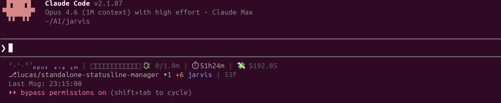
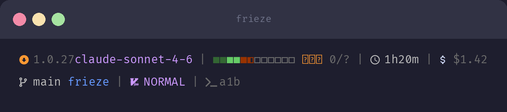
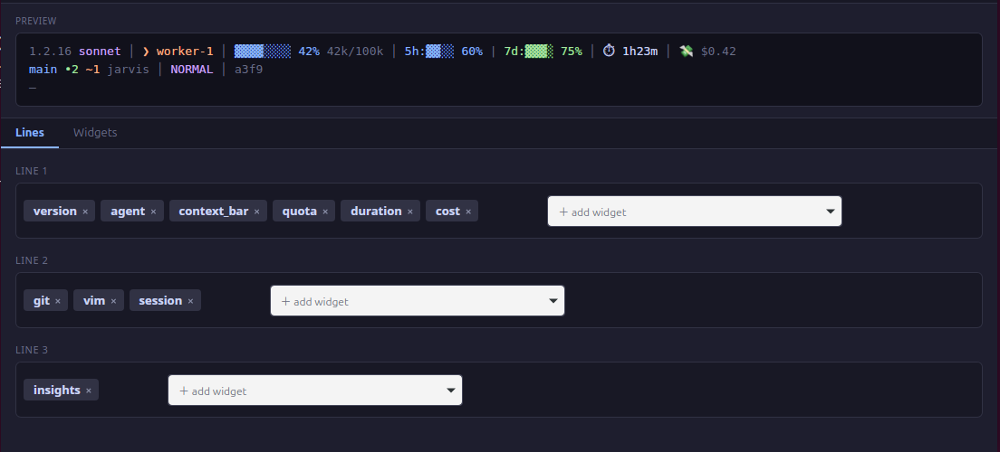
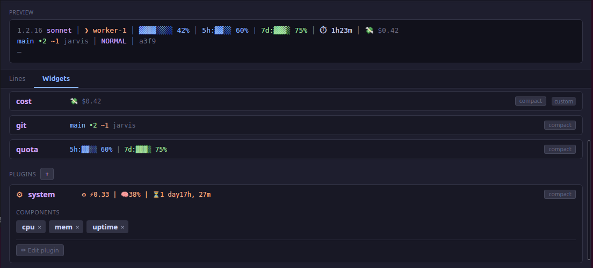

# soffit

[](https://crates.io/crates/soffit)
[](LICENSE)
[](https://github.com/noxcraftdev/soffit/actions)

Customizable statusline manager for [Claude Code](https://docs.anthropic.com/en/docs/claude-code).
Desktop editor with drag-and-drop, live preview, and a widget system for custom statusline extensions.





## Features

- **9 built-in widgets**: context bar, cost, git, version, duration, vim mode, agent, quota, session
- **Configurable theme**: custom colors, icons, and bar styles via config or the desktop editor
- **Desktop editor**: drag-and-drop widget ordering, live preview, per-widget component configuration
- **Custom widgets**: create your own widgets as shell scripts or compiled binaries
- **Auto-detection**: widgets declare components via JSON output for full editor integration
- **Terminal-width aware**: automatic wrapping and responsive bar widths

## Install

### Pre-built binary (recommended)
```bash
curl -fsSL https://raw.githubusercontent.com/noxcraftdev/soffit/main/install.sh | sh
```

### Homebrew (macOS/Linux)
```bash
brew tap noxcraftdev/soffit
brew install soffit
```

### From source
```bash
cargo install soffit
```

### System dependencies (Linux, build from source only)
```bash
sudo apt install libgtk-3-dev libwebkit2gtk-4.1-dev libxdo-dev libsoup-3.0-dev libjavascriptcoregtk-4.1-dev
```

### Supported platforms

- Linux (x86_64)
- macOS (Intel and Apple Silicon)

## Setup

Run the setup command to configure Claude Code automatically:

```bash
soffit setup
```

Or add manually to `~/.claude/settings.json`:

```json
{
  "statusLine": {
    "type": "command",
    "command": "soffit render",
    "padding": 0
  }
}
```

## Usage

```bash
soffit setup           # Configure Claude Code to use soffit (writes settings.json)
soffit render          # Render statusline (reads Claude Code JSON from stdin)
soffit edit            # Open the desktop config editor
soffit widgets         # List available widgets (built-in + custom)
soffit widget <name>   # Test a single widget
```

## Configuration

Config lives at `~/.config/soffit/config.toml` (falls back to `~/.config/claude-statusline/config.toml`):

```toml
statusline_line1 = ["vim", "agent", "version", "context_bar", "quota", "duration", "cost"]
statusline_line2 = ["git", "insights"]
statusline_line3 = []

cost_target_weekly = 300.0
autocompact_pct = 100

[statusline_widgets.cost]
compact = false
components = ["session", "today", "week"]
```

### Theme

Override semantic color roles using ANSI 256-color indices:

```toml
[palette]
success = 114     # green tones (context bar ok, git clean)
warning = 215     # orange tones (quota approaching, cost high)
danger  = 203     # red tones (quota critical, over budget)
muted   = 242     # dimmed text (secondary info)
subtle  = 250     # light gray (tertiary info)
primary = 111     # blue tones (main accent)
accent  = 183     # purple tones (secondary accent)
```

All 7 roles have built-in defaults.
Unset roles use the defaults.

### Icons

Override icons per widget under `[statusline_widgets.NAME.icons]`:

```toml
[statusline_widgets.cost.icons]
cost = "$ "          # instead of 💸

[statusline_widgets.duration.icons]
duration = "T "      # instead of ⏱

[statusline_widgets.git.icons]
git_branch = " "    # nerd font branch icon

[statusline_widgets.agent.icons]
agent = "> "         # ASCII fallback
```

Available icon keys per widget are shown in `soffit edit` under the widget's appearance panel.

### Bar style

Choose a preset for the quota progress bar:

```toml
bar_style = "block"   # ◎◉● density (default)
bar_style = "dot"     # ●○
bar_style = "ascii"   # #-
```

### Unicode text

Superscript/subscript rendering in the version widget can be toggled:

```toml
use_unicode_text = false   # plain text instead of ¹·²·³ / ₛₒₙₙₑₜ
```

## Custom Widgets

Drop scripts in `~/.config/soffit/plugins/`:

```bash
#!/bin/bash
# ~/.config/soffit/plugins/weather.sh
INPUT=$(cat)
COMPACT=$(echo "$INPUT" | python3 -c "import json,sys; print(json.load(sys.stdin).get('config',{}).get('compact',False))" 2>/dev/null)

TEMP="22°C"
COND="sunny"

if [ "$COMPACT" = "True" ]; then
  echo "{\"output\": \"$TEMP\", \"components\": [\"temp\", \"condition\"]}"
else
  echo "{\"output\": \"☀ $TEMP $COND\", \"components\": [\"temp\", \"condition\"]}"
fi
```

Make it executable: `chmod +x ~/.config/soffit/plugins/weather.sh`

### Widget input format

Widgets receive JSON on stdin:

```json
{
  "data": {
    "session_id": "abc123",
    "version": "1.2.16",
    "model": {"display_name": "claude-sonnet-4-6"},
    "context_window": {"used_percentage": 42.0},
    "cost": {"total_duration_ms": 4830000, "total_cost_usd": 0.42},
    "vim": {"mode": "NORMAL"},
    "agent": {"name": "worker-1"}
  },
  "config": {
    "compact": false,
    "components": ["temp", "condition"]
  },
  "palette": {
    "primary":  "\u001b[38;5;111m",
    "accent":   "\u001b[38;5;183m",
    "success":  "\u001b[38;5;114m",
    "warning":  "\u001b[38;5;215m",
    "danger":   "\u001b[38;5;203m",
    "muted":    "\u001b[38;5;242m",
    "subtle":   "\u001b[38;5;250m",
    "reset":    "\u001b[0m"
  }
}
```

### Widget output format

Return JSON with `parts` so the framework reorders components per user config:
```json
{"parts": {"temp": "22°C", "condition": "sunny"}, "components": ["temp", "condition"]}
```

Or return a pre-composed string (component reordering won't apply):
```json
{"output": "22°C sunny", "components": ["temp", "condition"]}
```

Or return plain text:
```
22°C sunny
```

### Widget metadata (optional)

Create a `.toml` sidecar for richer editor integration:

```toml
# ~/.config/soffit/plugins/weather.toml
description = "Current weather conditions"
components = ["temp", "condition"]
has_compact = true
```

## Marketplace

The marketplace subcommand manages a list of named widget sources (GitHub repos that publish a `registry.json`).
By default soffit ships with the official `noxcraftdev/soffit-marketplace` source.

```bash
# Add a community source
soffit marketplace add community alice/soffit-extras

# List registered sources (no network)
soffit marketplace list

# List sources with widget counts (fetches or uses cached registry)
soffit marketplace list --verbose

# Remove a source
soffit marketplace remove community

# Refresh the cached registry for all sources (or one with --source)
soffit marketplace update
soffit marketplace update --source community
```

### Installing from the marketplace

Once sources are configured, install by widget name — soffit searches all sources:

```bash
soffit install <name>          # resolves from marketplace sources
soffit install owner/repo      # installs all widgets from a repo directly
soffit install owner/repo/name # installs a single widget from a specific repo
```

### Publishing a marketplace source

Create a `registry.json` at the root of any public GitHub repo:

```json
{
  "plugins": [
    {
      "name": "weather",
      "description": "Current weather conditions",
      "repo": "alice/soffit-extras",
      "file": "weather.sh"
    }
  ]
}
```

Then share the source with: `soffit marketplace add your-source alice/soffit-extras`.

## Community Widgets

Install widgets shared on GitHub:

```bash
# Install all widgets from the official collection
soffit install noxcraftdev/soffit-plugins

# Install a specific widget
soffit install noxcraftdev/soffit-plugins/last-msg

# Remove an installed widget
soffit uninstall last-msg

# Overwrite an existing widget
soffit install noxcraftdev/soffit-plugins --force
```

Installed widgets land in `~/.config/soffit/plugins/` and are immediately available.

### Creating a widget repository

Lay out your repo as a flat directory of `{name}.sh` + `{name}.toml` pairs:

```
my-soffit-plugins/
  weather.sh
  weather.toml
  stocks.sh
  stocks.toml
```

soffit looks for this layout at the repo root first, then inside a `plugins/` subdirectory.
Multiple widgets per repo is the norm — a single repo can host an entire collection.

The `.toml` sidecar is optional but recommended: it supplies the description and component list shown in `soffit edit`.

## Editor

`soffit edit` opens a desktop GUI:

- **Lines tab**: drag-and-drop widgets across 3 statusline rows
- **Widgets tab**: configure built-in widgets (reorder components, toggle compact mode)
- **Widget management**: create, edit, preview, rename, delete custom widgets
- **Live preview**: see your statusline update in real-time




<video src="assets/editor-demo.webm" autoplay loop muted playsinline width="100%"></video>

## License

MIT
